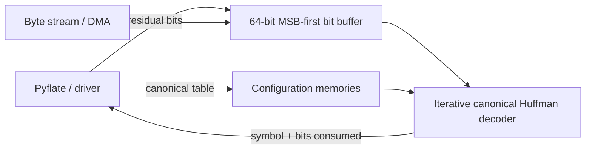

# Pyflate Huffman Hardware Accelerator

This directory contains a synthesizable SystemVerilog design for accelerating
the canonical Huffman symbol lookup used by the BZip2 path of `pyflate`.

## Why this block

A local `cProfile` run of the unmodified benchmark (three decompressions of the
provided input) measured 4.101 s overall. `decode_huffman_block` accounted for
4.022 s cumulative (98.1%), and its repeated `find_next_symbol` calls accounted
for 1.667 s cumulative (40.6%) across 444,813 calls. The latter is the direct
target of this accelerator. The result is provisional because the final report
must repeat the profile inside the course QEMU environment.

A later run through the included reproducibility script measured 1.383 s in
`find_next_symbol` out of 3.223 s in `bench_pyflake` (42.9%). This difference is
normal profiling/environment variation. The performance model below retains
the lower 40.6% value as a conservative assumption until the QEMU run.

Times of nested functions such as `snoopbits`, `readbits`, and `_mask` must not
be added to the cumulative time of `find_next_symbol`; doing so double-counts
the same execution time. This is why the defensible hotspot fraction is about
40.6%, rather than the earlier 67% estimate.

## Architecture



The design consists of:

- `bit_buffer.sv`: accepts a ready/valid byte stream, keeps the next bits
  MSB-aligned, exposes a 20-bit look-ahead window, and consumes a decoded code.
- `huffman_decoder.sv`: stores six independent canonical Huffman tables, each
  covering lengths 1–20 and up to 258 symbols. This matches BZip2's 2–6 table
  groups, which Pyflate selects in groups of 50 decoded symbols. The decoder
  checks one code length per clock until it finds a matching range, then
  computes the symbol index directly.
- `pyflate_huffman_accelerator.sv`: top-level integration and external ports.

For a length `L`, the decoder tests:

```text
first_code[L] <= prefix[L] <= last_code[L]
symbol_index = first_symbol_index[L] + prefix[L] - first_code[L]
```

This replaces Python's object traversal and per-symbol bit manipulation with
bounded integer comparisons and one table read. The iterative architecture was
chosen instead of a large 2^20 lookup table: it needs at most 20 check cycles,
uses small memories, and supports the per-block dynamic Huffman tables in BZip2.

The proposed target clock is **100 MHz** (10 ns period). A 200 MHz clock is a
possible stretch target, but neither value is claimed as achieved because the
assignment does not require synthesis or static timing analysis.

## Interface and software flow

All streaming ports use ready/valid handshakes. Configuration is accepted only
while the decoder is idle (`cfg_ready=1`).

| Port group | Main signals and widths | Meaning |
| --- | --- | --- |
| Clock/reset | `clk` (1), `rst_n` (1), `stream_reset` (1) | Global active-low reset and per-stream bit-buffer reset |
| Residual-bit seed | `seed_valid`, `seed_ready` (1), `seed_data` (64), `seed_count` (7) | Loads MSB-aligned bits already fetched by software when handoff occurs mid-byte |
| Compressed input | `byte_valid` (1), `byte_ready` (1), `byte_data` (8) | MSB-first input byte stream |
| Table selection | `cfg_table_select` (3), `decode_table_select` (3) | Select one of six resident BZip2 tables for writes or a decode request |
| Table bounds | `cfg_bounds_valid` (1), `cfg_min_length` (5), `cfg_max_length` (5) | Minimum and maximum active code lengths |
| Length entry | `cfg_length_valid` (1), `cfg_length` (5), `cfg_first_code` (20), `cfg_last_code` (20), `cfg_first_symbol_index` (9) | Canonical-code range for one length |
| Symbol entry | `cfg_symbol_valid` (1), `cfg_symbol_index` (9), `cfg_symbol_value` (9) | Ordered Huffman symbol memory write |
| Decode request | `decode_valid` (1), `decode_ready` (1) | Request one output symbol |
| Decode result | `symbol_valid` (1), `symbol_ready` (1), `symbol_value` (9), `bits_consumed` (5) | Decoded symbol and matched code length |
| Status | `cfg_ready`, `need_more_bits`, `decode_error`, `busy` (1 each), `buffered_bits` (7) | Flow-control, error, and occupancy status |

1. Software parses the BZip2 block header and constructs the canonical table.
2. For each of the 2–6 BZip2 Huffman groups, it selects a configuration bank,
   asserts `cfg_clear`, writes the length ranges, and writes the ordered symbols.
3. Because parsing can finish mid-byte, software writes its residual
   `RBitfield` bits through `seed_data/seed_count`, then transfers subsequent
   compressed bytes to `byte_data`, preferably through DMA or a buffered driver.
4. Software supplies the next selector as `decode_table_select`. A
   `decode_valid` request produces `symbol_value`, `bits_consumed`, and
   `symbol_valid`; the decoder stalls with `need_more_bits` if input is missing.
5. Software retains the BWT, move-to-front, and run-length stages. A new BZip2
   block reloads the table; `stream_reset` clears only buffered stream bits.

DMA may read ahead beyond the end-of-block symbol. This does not advance the
logical software position: the driver sums `bits_consumed` (531,571 Huffman
bits for the supplied input) and resumes from that exact bit position in the
original compressed buffer. The real-trace test checks every reported length.

An actual SoC wrapper would map the configuration registers and status bits to
MMIO and connect byte/symbol FIFOs to DMA. Per-symbol MMIO would erase much of
the gain, so batching is part of the intended HW/SW partition.

A possible 32-bit MMIO wrapper is shown below. It is an integration proposal;
the submitted RTL exposes the lower-level handshake signals so it is not tied
to a particular bus such as AXI4-Lite or Avalon.

| Offset | Register | Purpose |
| ---: | --- | --- |
| `0x00` | `CONTROL` | Stream reset, selected-table clear, and interrupt enable |
| `0x04` | `STATUS` | Busy, configuration ready, input space, output available, and error |
| `0x08` | `TABLE_SELECT` | Configuration bank and decode bank (0–5) |
| `0x0c` | `LENGTH_BOUNDS` | Five-bit minimum and maximum code lengths |
| `0x10` | `LENGTH_CODE_RANGE` | Length plus first/last canonical code; written as a short sequence if one word is insufficient |
| `0x14` | `FIRST_SYMBOL_INDEX` | Nine-bit base index for the selected length |
| `0x18` | `SYMBOL_WRITE` | Nine-bit symbol index and nine-bit value |
| `0x1c`–`0x20` | `SEED_DATA_COUNT` | Residual MSB-aligned bits and valid-bit count for a mid-byte handoff |
| `0x24` | `INPUT_FIFO` | Compressed input bytes, normally DMA-fed |
| `0x28` | `OUTPUT_FIFO` | Symbol, consumed-bit count, and error flag |

The driver should configure all table banks once per BZip2 block, submit the
selector sequence and compressed bytes in batches, and drain decoded symbols
in batches. Interrupts should be used per buffer or block, not per symbol.

## Expected performance

Using the provisional hotspot fraction `p = 0.406`, Amdahl's law gives the
following whole-benchmark upper-level estimates before transfer overhead:

| Decoder speedup | Estimated total speedup |
| ---: | ---: |
| 2x | 1.255x |
| 4x | 1.438x |
| 8x | 1.551x |
| Infinite | 1.684x |

At 100–200 MHz the decoder takes between 1 and 20 length-check cycles plus
handshake overhead for a symbol. Real speedup depends on code-length
distribution, table reload cost, DMA/FIFO bandwidth, CPU–accelerator overlap,
and the QEMU reference CPU. These figures are therefore projections, not
measured hardware results.

Instrumentation of the actual repository input found 148,271 decoded symbols
and an average of 2.361 length checks per symbol. Including one request cycle
and one output-handshake cycle per symbol, the current FSM requires 646,642
modeled cycles: 6.47 ms at the proposed 100 MHz clock or 3.23 ms at 200 MHz,
before DMA, driver, and table-configuration overhead. The script and full
results are in `scripts/analyze_workload.py` and `verification_results.md`.
The 8x row above is consequently a conservative system-level scenario; with
efficient batching, the theoretical ceiling is governed mainly by Amdahl's law.

## Verification

The self-checking testbench covers:

- canonical codes of lengths 1, 2, and 3;
- a symbol spanning a byte boundary;
- a decode request that stalls until another byte arrives;
- table reset and reconfiguration;
- an invalid prefix, including verification that no input bit is consumed.
- selection between two resident table banks and rejection of an invalid bank.

Run with Icarus Verilog:

```bash
bash ./scripts/run_simulation.sh
```

The successful run ends with `ALL TESTS PASSED`. The same testbench was also
compiled and executed with Verilator 5.49.

The benchmark-specific differential test extracts the real Huffman tables,
four residual handoff bits, compressed stream, and expected symbols from
Python, then compares every RTL result:

```bash
bash ./scripts/run_real_trace.sh
```

The verified input contains 148,271 Huffman symbols. The test passed with zero
symbol or code-length mismatches and ends with `REAL TRACE PASSED`.

To reproduce the hotspot measurement in the course VM:

```bash
python3 -m cProfile -o pyflate/profiling/cprofile.prof \
  pyflate/hardware/scripts/profile_hotspot.py 3
python3 -m pstats pyflate/profiling/cprofile.prof
# At the pstats prompt: sort cumulative
# Then: stats 25
```

Run this from the repository root and record the total time, cumulative time,
call count, Python/QEMU environment, and command in the final report.

## Trade-offs and limitations

- The iterative search minimizes area but has variable latency. A parallel
  comparator bank or a short-prefix lookup table would increase throughput at
  the cost of area and power.
- Table storage is 20,292 logical bits (approximately 20.3 kbit), plus a 64-bit
  input reservoir: each of the six banks has 2,322 symbol bits and 1,060 bits
  of per-length metadata and bounds. Yosys 0.69 confirmed seven inferred
  memories totaling 20,292 bits. The remaining datapath is primarily a 20-bit subtractor, range
  comparators, shifter, counters, and the control FSM. This is still not a
  post-place-and-route physical area figure. A one-bank variant saves roughly
  16.9 kbit but would pay frequent reconfiguration overhead.
- One active comparator path per cycle keeps switching activity lower than a
  fully parallel 20-length search. Dynamic power would rise with clock rate and
  stream utilization; clock gating the decoder while idle is a natural SoC
  optimization. No numerical power claim is made without a target technology.
- The design accelerates Huffman lookup and bit consumption only. BWT reversal
  and move-to-front remain in software and limit total speedup.
- Only one symbol is in flight. Pipelining or multiple decoder lanes could raise
  throughput but would require more complex handling of variable-length codes.
- The real-trace test verifies the complete Huffman symbol stream. A future
  physical/SoC implementation should additionally run the downstream software
  stages and compare the complete decompressed output with the existing MD5.
