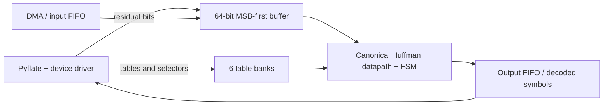

# Part 7 — Hardware Acceleration Proposal for Pyflate

## 1. Selected bottleneck

The proposed accelerator targets `HuffmanTable.find_next_symbol`, which is
called from the main BZip2 decompression loop in `decode_huffman_block`. For
each compressed symbol, the Python implementation traverses Huffman-table
objects, repeatedly peeks at the bit stream for new code lengths, compares the
candidate code, and finally removes the matched bits.

A local `cProfile` experiment on the unchanged repository input performed
three complete decompressions. It measured 4.101 s total runtime and 1.667 s
cumulative time in 444,813 calls to `find_next_symbol`, or approximately 40.6%
of the profiled runtime. `decode_huffman_block` accounted for 4.022 s
cumulative (98.1%), but it also contains BWT reversal, move-to-front updates,
run-length processing, and the Huffman calls. Therefore, the hardware target is
the narrower and directly implementable 40.6% component.

The earlier estimate of 67% was obtained by adding cumulative times of nested
functions such as `find_next_symbol`, `snoopbits`, `readbits`, and `_mask`.
Those values overlap and must not be summed. The 40.6% figure avoids that
double counting. Because this profile was collected outside the course QEMU
VM, the final submitted report should replace or confirm it with a run in the
official environment.

As a reproducibility check, a later run of the included profiling script
measured 1.383 s cumulative in `find_next_symbol` out of 3.223 s in
`bench_pyflake`, or 42.9%. The analysis retains the lower 40.6% value as a
conservative assumption; the official QEMU result should be the submitted one.

This component is suitable for hardware because it is invoked roughly 148,000
times per decompression, uses bounded-width integer operations, has predictable
control flow, and operates on small canonical Huffman tables. It does not
require Python object semantics once the tables are converted into compact
arrays.

## 2. Hardware function and architecture

The implementation is in `hardware/rtl/` and consists of three SystemVerilog
modules:

1. `bit_buffer.sv` accepts compressed bytes through a ready/valid interface. It
   keeps the next bits MSB-aligned in a 64-bit reservoir, exposes a 20-bit
   prefix, and removes the exact number of bits used by a decoded symbol.
2. `huffman_decoder.sv` stores six independent Huffman table banks. BZip2 uses
   two to six groups and selects a group for each run of 50 symbols, so keeping
   all six resident avoids repeated configuration. Each bank contains the
   first code, last code, and first symbol index for code lengths 1–20, plus an
   ordered memory of up to 258 nine-bit symbols.
3. `pyflate_huffman_accelerator.sv` connects the bit buffer and decoder and
   exposes the configuration, streaming, request, result, and status ports.

For a candidate length `L`, the main datapath evaluates:

```text
prefix = next_20_bits >> (20 - L)
match  = first_code[L] <= prefix <= last_code[L]
index  = first_symbol_index[L] + prefix - first_code[L]
```

If the range matches, `symbol_memory[index]` is returned and `L` bits are
removed from the input buffer. Otherwise, the controller checks the next code
length. This iterative implementation uses at most 20 check cycles per symbol.
It was chosen instead of a full 2^20-entry lookup table, which would have much
higher storage and switching costs.



## 3. Inputs, outputs, and operating frequency

The design uses ready/valid handshakes. Its proposed target frequency is
100 MHz, corresponding to a 10 ns clock period. A 200 MHz stretch target may be
possible, but no achieved timing value is claimed because synthesis and static
timing analysis are outside the assignment requirements.

| Interface | Signals | Width and purpose |
| --- | --- | --- |
| Clock/reset | `clk`, `rst_n`, `stream_reset` | One bit each; global reset and stream-only reset |
| Residual-bit seed | `seed_valid`, `seed_ready`, `seed_data`, `seed_count` | One-bit handshake, 64-bit MSB-aligned data, seven-bit count |
| Byte input | `byte_valid`, `byte_ready`, `byte_data` | One-bit handshake and one 8-bit compressed byte |
| Table selection | `cfg_table_select`, `decode_table_select` | Three bits; selects one of six banks |
| Table bounds | `cfg_bounds_valid`, `cfg_min_length`, `cfg_max_length` | Valid bit and two five-bit lengths |
| Length metadata | `cfg_length_valid`, `cfg_length`, `cfg_first_code`, `cfg_last_code`, `cfg_first_symbol_index` | One-bit valid, 5-, 20-, 20-, and 9-bit fields |
| Symbol write | `cfg_symbol_valid`, `cfg_symbol_index`, `cfg_symbol_value` | One-bit valid and two nine-bit fields |
| Decode request | `decode_valid`, `decode_ready` | One-bit ready/valid handshake |
| Decode result | `symbol_valid`, `symbol_ready`, `symbol_value`, `bits_consumed` | One-bit handshake, nine-bit symbol, five-bit length |
| Status | `cfg_ready`, `need_more_bits`, `decode_error`, `busy`, `buffered_bits` | Flow control, error indication, and seven-bit occupancy |

## 4. Hardware/software integration

Pyflate continues to parse the BZip2 header in software. After
`compute_tables` creates the two to six canonical tables for a block, a driver
converts each Python table into the three per-length arrays and the ordered
symbol array, then programs a corresponding hardware bank. The selector list
that Pyflate already computes determines `decode_table_select` for each group
of 50 symbols.

Header parsing can end in the middle of a byte. The Python `RBitfield` may
therefore already contain several unread bits while its file pointer addresses
the following byte. The driver MSB-aligns those residual bits in `seed_data`,
writes their count through `seed_count`, and only then starts the byte stream.
For the supplied input this handoff contained four residual bits (`1110`); the
real-trace simulation verified the handoff exactly.

Compressed bytes and decoded symbols should be transferred through FIFOs using
DMA or large buffered driver calls. Issuing an MMIO transaction and interrupt
for every symbol would add excessive overhead and could eliminate the benefit.
A practical driver API could provide three operations:

```text
configure_block(tables, selector_list, residual_bits, residual_count)
submit_compressed_buffer(input_address, byte_count)
receive_symbols(output_address, maximum_symbols) -> consumed_bit_count
```

DMA may prefetch beyond the end-of-block symbol. Software therefore resumes
from the logical position computed from the returned consumed-bit count, not
from the physical DMA read-ahead pointer. For the supplied input the verified
Huffman stream consumed 531,571 bits.

The SoC wrapper can expose control/status and table metadata as 32-bit MMIO
registers while connecting the input and output FIFOs to DMA. The accelerator
raises an interrupt on buffer completion, output watermark, or error. Software
retains move-to-front decoding, run-length expansion, BWT reversal, CRC checks,
and final output validation.

## 5. Expected acceleration

Let `p = 0.406` be the locally measured fraction spent in the selected
component, and let `S_hw` be its effective acceleration including transfer and
driver overhead. Amdahl's law gives:

```text
S_total = 1 / ((1 - p) + p / S_hw)
```

| Effective Huffman speedup | Estimated whole-benchmark speedup |
| ---: | ---: |
| 2x | 1.255x |
| 4x | 1.438x |
| 8x | 1.551x |
| Infinite | 1.684x |

Instrumentation of the real repository input measured 148,271 decoded symbols
and an average of 2.361 length checks per symbol. The current state machine
therefore needs 350,100 check cycles and 296,542 request/output protocol cycles,
for 646,642 cycles in total. This corresponds to 6.47 ms at the proposed
100 MHz clock or 3.23 ms at 200 MHz, before transfer and configuration costs.
An effective 8x component speedup is therefore a conservative system-level
objective if data is batched; it predicts about a 1.55x overall speedup. The
theoretical ceiling is about 1.68x because the remaining 59.4% is not
accelerated.

These are analytical estimates, not measured hardware results. The final
result depends on the official profile, code-length distribution, bus and DMA
bandwidth, table setup frequency, output buffering, and overlap with CPU work.

## 6. Performance, area, and power trade-offs

The six table banks require 20,292 logical storage bits: six times 2,322 symbol
bits and 1,060 metadata/bounds bits, plus a separate 64-bit input reservoir.
Yosys 0.69 confirmed seven inferred memories totaling 20,292 bits. The
datapath adds a 20-bit subtraction, range comparators, a variable shifter,
counters, multiplexers, and a small state machine. This validates logical
storage and memory inference, but physical area depends on the selected FPGA or
ASIC technology, technology mapping, and placement and routing.

The selected iterative decoder activates one comparator path per cycle. This
reduces area and switching power but gives variable latency. A parallel bank of
comparators could inspect all lengths in one cycle, raising throughput at the
cost of combinational delay, area, and power. A short-prefix lookup table would
offer a middle ground. Similarly, retaining all six BZip2 tables costs roughly
17 Kibit more than a single-bank variant, but avoids reprogramming whenever the
selector changes after 50 symbols.

Dynamic power increases with clock frequency and stream activity. Clock gating
the decoder while `busy=0` and the memories while no access is requested would
reduce idle power. Numerical power and timing claims require synthesis and a
specific technology and are intentionally not fabricated here.

## 7. Verification and remaining integration work

The self-checking testbench in `hardware/tb/` verifies canonical codes of
several lengths, byte-boundary crossing, bit-buffer underflow and refill,
run-time table-bank selection, table reconfiguration, invalid prefixes, and an
invalid table identifier. Both lint and simulation pass with Verilator 5.49;
the successful simulation ends with `ALL TESTS PASSED`. The included shell
script runs the same testbench with Icarus Verilog.

An additional differential test generates table entries, residual handoff
bits, compressed bytes, and expected results from the real Pyflate input. The
RTL matched Python for all 148,271 decoded symbols and their code lengths, with
zero mismatches across all six table banks. A future physical/SoC integration
should additionally pass the output through the downstream software stages and
compare the complete decompressed data using the existing MD5 check.
