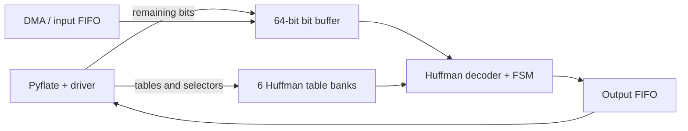

# Part 7 - Hardware Acceleration for Pyflate

## 1. Bottleneck and main idea

The slow part of Pyflate is not one large calculation. Instead, Python repeats
a small bit-by-bit Huffman lookup for every decoded symbol. This happens about
148,000 times in one decompression, so we chose
`HuffmanTable.find_next_symbol` as the target for hardware acceleration.

A local `cProfile` run of three decompressions took 4.101 seconds. Out of this,
1.667 seconds were spent in 444,813 calls to `find_next_symbol`, which is 40.6%
of the runtime. A second run gave 42.9%. We use the lower value in the speedup
calculation so that the estimate is not overly optimistic.

Once the Python Huffman tables are converted into arrays, the work done by this
function is fairly simple: keep the next bits from the compressed stream, find
the first matching Huffman code range, return the symbol, and consume the bits
that were used. These are small integer operations that can be implemented
directly in hardware.

## 2. Accelerator design

We divided the accelerator into three SystemVerilog modules:

1. `bit_buffer.sv` receives compressed bytes and stores them in a 64-bit
   MSB-first buffer. It exposes the next 20 bits to the decoder and removes the
   number of bits used by each decoded symbol.
2. `huffman_decoder.sv` stores the Huffman tables and searches for a matching
   code. During the real-input test, we found that BZip2 can keep up to six
   Huffman groups and change the selected group every 50 symbols. The final
   design therefore keeps six table banks in hardware.
3. `pyflate_huffman_accelerator.sv` connects the two modules and exposes the
   external configuration and streaming signals.

For each possible code length `L`, the decoder performs the following check:

```text
prefix = next_20_bits >> (20 - L)
match  = first_code[L] <= prefix <= last_code[L]
index  = first_symbol_index[L] + prefix - first_code[L]
```

If the range matches, `symbol_memory[index]` is returned and `L` bits are
removed from the input buffer. If it does not match, the decoder checks the
next length.

One option was to compare all possible lengths in parallel. That would improve
throughput, but would also use more comparators and create a longer
combinational path. We chose a simpler FSM that checks one length per clock
cycle. It may need up to 20 checks, but the actual average for the supplied
input is only 2.361 checks per symbol. It also avoids a very large 2^20-entry
lookup table.



The RTL uses ready/valid handshakes. We use 100 MHz, or a 10 ns clock period,
as the target frequency. This is a proposed target and was not confirmed by
static timing analysis.

| Interface | Signals | Width and purpose |
| --- | --- | --- |
| Clock and reset | `clk`, `rst_n`, `stream_reset` | 1 bit each; global reset and stream reset |
| Remaining bits | `seed_valid`, `seed_ready`, `seed_data`, `seed_count` | 1-bit handshake, 64-bit data, 7-bit count |
| Byte input | `byte_valid`, `byte_ready`, `byte_data` | 1-bit handshake and one 8-bit byte |
| Table selection | `cfg_table_select`, `decode_table_select` | 3 bits; selects one of six banks |
| Table bounds | `cfg_bounds_valid`, `cfg_min_length`, `cfg_max_length` | 1-bit valid and two 5-bit lengths |
| Length entry | `cfg_length_valid`, `cfg_length`, `cfg_first_code`, `cfg_last_code`, `cfg_first_symbol_index` | 1, 5, 20, 20, and 9 bits |
| Symbol entry | `cfg_symbol_valid`, `cfg_symbol_index`, `cfg_symbol_value` | 1, 9, and 9 bits |
| Decode request | `decode_valid`, `decode_ready` | 1-bit ready/valid handshake |
| Decode result | `symbol_valid`, `symbol_ready`, `symbol_value`, `bits_consumed` | 1-bit handshake, 9-bit symbol, 5-bit length |
| Status | `cfg_ready`, `need_more_bits`, `decode_error`, `busy`, `buffered_bits` | 1-bit flags and a 7-bit buffer count |

## 3. Connection to Pyflate

Pyflate still parses the BZip2 block header in software. It then converts the
Huffman tables into the arrays expected by the accelerator and writes them into
the six banks. The selector list that Pyflate already creates tells the hardware
which bank to use for each group of symbols.

The handoff from software to hardware has one less obvious case. Header parsing
can stop in the middle of a byte. At that point, `RBitfield` already contains a
few unread bits while the file pointer has moved to the following byte. The
driver must send these bits through `seed_data` and `seed_count` before sending
the rest of the byte stream. In the supplied input, the handoff contained four
bits: `1110`.

The compressed bytes and decoded symbols should be moved in batches through
FIFOs and DMA. Performing one MMIO access or interrupt per symbol would probably
cost more than the lookup itself. From the software side, the driver needs
operations similar to these:

```text
configure_block(tables, selector_list, residual_bits, residual_count)
submit_compressed_buffer(input_address, byte_count)
receive_symbols(output_address, maximum_symbols) -> consumed_bit_count
```

DMA may read a few bytes beyond the final Huffman symbol, so the driver should
continue from the logical position reported by `consumed_bit_count`, not from
the physical read-ahead position. The move-to-front, run-length, BWT, CRC, and
output-validation stages remain in software.

We implemented the accelerator interface itself, but not a specific AXI,
DMA, or MMIO wrapper. Those parts depend on the SoC in which the accelerator is
used.

## 4. Performance and hardware cost

We use Amdahl's law to estimate the effect on the complete benchmark. With
`p = 0.406` as the measured fraction and `S_hw` as the effective speedup of the
Huffman lookup, including communication overhead:

```text
S_total = 1 / ((1 - p) + p / S_hw)
```

| Huffman speedup | Estimated total speedup |
| ---: | ---: |
| 2x | 1.255x |
| 4x | 1.438x |
| 8x | 1.551x |
| Infinite | 1.684x |

The real input contains 148,271 Huffman symbols. Based on their code lengths,
the FSM needs 646,642 modeled cycles, including request and output-handshake
cycles. At 100 MHz this is about 6.47 ms before DMA and table-configuration
overhead. If the hardware makes `find_next_symbol` effectively eight times
faster, the complete benchmark should improve by about 1.55x. Even an ideal
implementation cannot pass about 1.68x without moving more of the decompression
pipeline to hardware.

The main area cost comes from keeping all six tables at the same time. Together
they contain 20,292 bits of storage, in addition to the 64-bit input buffer.
Yosys inferred seven memories with the expected 20,292 bits. Keeping only one
table would save about 17 Kibit, but the table would have to be reloaded whenever
the selector changes. We preferred to pay the memory cost and avoid that
reconfiguration.

The iterative decoder also trades speed for area and power. It activates one
comparison path per cycle, while a parallel decoder would activate several.
Clock-gating the decoder while it is idle could further reduce switching. Exact
area, frequency, and power numbers require a specific FPGA or ASIC target, so
the current results should be treated as logical estimates rather than physical
measurements.

## 5. Verification and conclusion

The directed testbench covers several code lengths, crossing a byte boundary,
buffer underflow and refill, selection and reconfiguration of table banks,
invalid input, and an invalid table number. It passes with both Icarus Verilog
and Verilator and ends with `ALL TESTS PASSED`.

We also wanted to test more than a few manually selected codes. A Python script
therefore records the Huffman tables, remaining input bits, compressed bytes,
and expected results from an actual Pyflate run. The RTL then decodes the same
trace. All 148,271 symbols and their code lengths matched the Python result,
with zero mismatches. This test also checks all six table banks and the four-bit
software-to-hardware handoff.

Together, these results show that the accelerator reproduces Pyflate's Huffman
decoding behavior for the supplied input. The implementation includes the
decoding datapath, control logic, table storage, and software-facing interface.
With an effective 8x speedup for the Huffman lookup, the estimated speedup for
the complete benchmark is about 1.55x.
